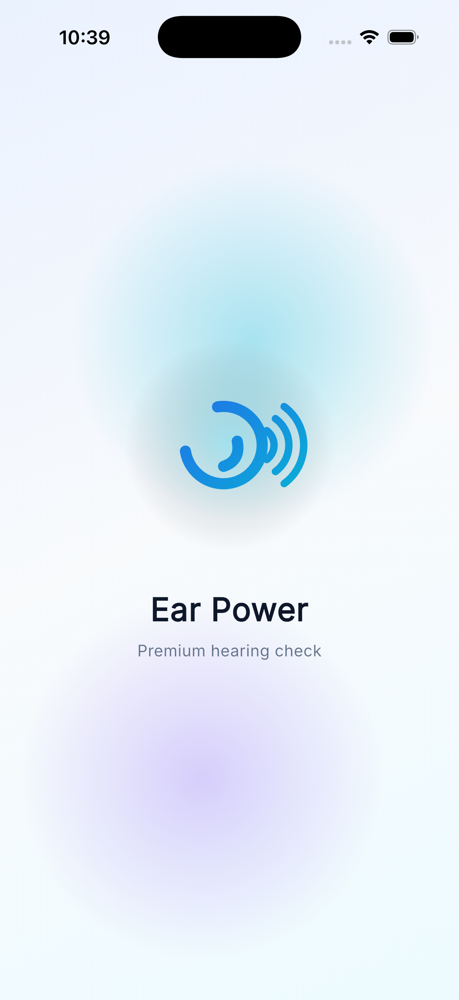
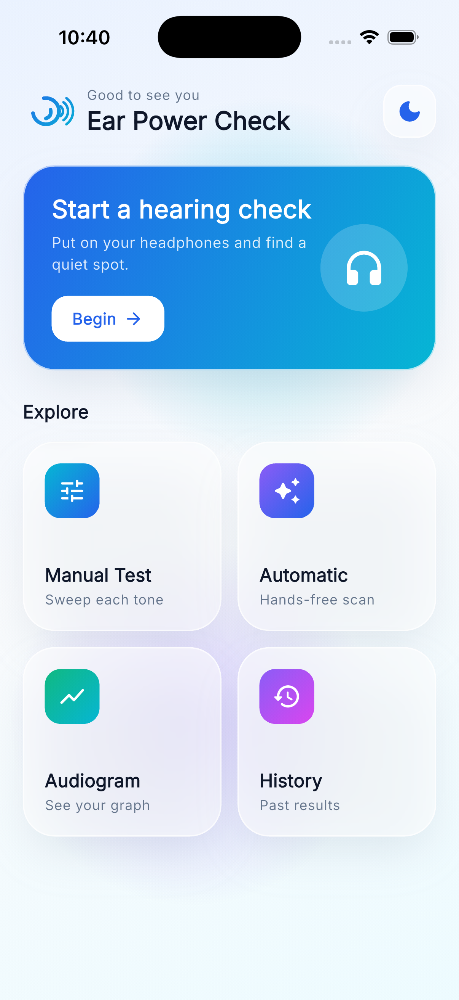
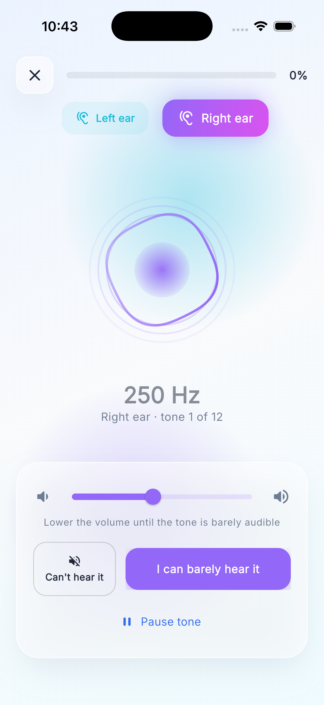
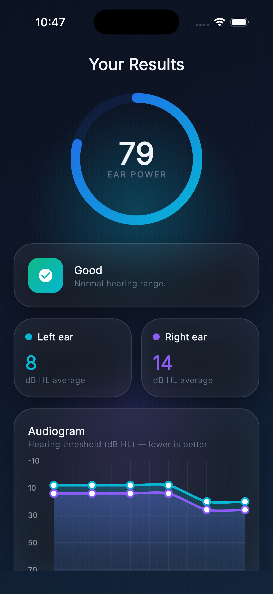

# Ear Power Check

A premium, animated Flutter hearing-screening app — glassmorphism UI, real pure-tone audio generation, dark & light modes.

## Screenshots

| Splash | Home | Ear Test | Results |
|:------:|:----:|:--------:|:-------:|
|  |  |  |  |

## Features

- **Real tone generation** — pure sine tones (250 Hz–8 kHz) with per-ear L/R panning via `flutter_soloud`
- **Premium UI** — glassmorphism cards, soft gradients, animated ambient background, custom page transitions
- **Live audio visualizer** — circular waveform with pulsing rings reacting to the active tone
- **Animated results** — score-reveal ring, per-ear summaries, and an animated audiogram (`fl_chart`)
- **Dark & light modes** with persisted preference

## Getting Started

```bash
flutter pub get
flutter run
```

> **Note:** `flutter_soloud` builds a native audio engine and requires **CMake** on the build machine (`brew install cmake` on macOS).

Hearing results are a self-screening, not a medical diagnosis — they depend on your headphones and surroundings.

## Resources

- [Learn Flutter](https://docs.flutter.dev/get-started/learn-flutter)
- [Flutter documentation](https://docs.flutter.dev/)
